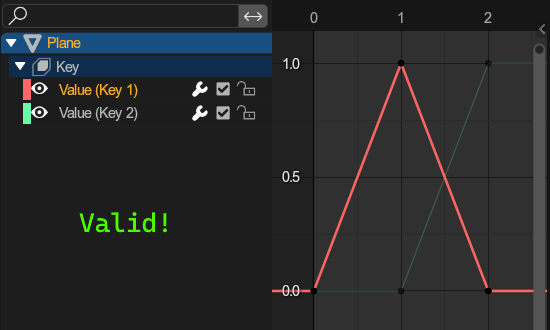
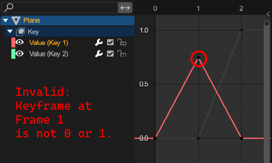
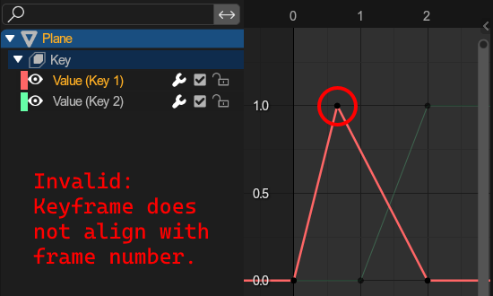
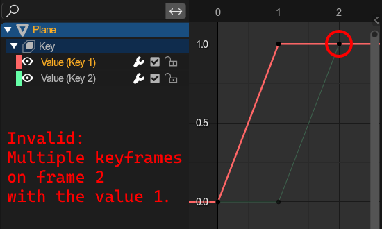

# Animating
Both adventure games use the same animation systems, of which blender distinguishes between 3 types.

Read about [importing animations here](../ui/toolbar/tools/import.md#import-node-animation) and about [exporting animations here](../ui/toolbar/tools/export.md#export-animations).

## Node Animations
Node animations are the simplest and most intuitive animations. They animate a nodes

- Position
- Rotation
- Scale

Node animations can be applied to single objects and bones in an armature, and are stored completely in a single action.

## Shape Animations
Shape animations animate a models shape using blender shape keys, used for e.g. animating facial expressions.

Since shapekey animations are distributed across multiple mesh object, you will have to ensure that all shape animations start with the same name, followed by an underscore and then the objects name.
 The export window will tell you which animations are being exported.

**Example:** You have the objects `Body` and `Head`. They both have a shapekey animation that should be combined into one file. The overall animation should be called `ShapeAnim`.

- The animation for `Body` should be called `ShapeAnim_Body`
- The animation for `Head` should be called `ShapeAnim_Head`

### Limitations
Shape animations are very limited. The following conditions must be met:

- All keyframes need to be a value of either 0 or 1.
- No two keyframes of value 1 may share the same frame.
- All frames must be a rounded frame number

|||
|---|---|
|||

## Camera Animations
These animate cameras, and consist of:

- Camera position
- Target position
- Roll
- Field of view

To create a camera animation, you must first [create a camera setup](../ui/toolbar/tools/utilities.md#create-camera-setup). A single camera animation will then require 3 different actions, all of which must follow a specific naming format:

- `%_position`: Animates the camera position (On camera object).
- `%_target`: Animates the camera target position and camera roll using the z rotation (On camera target object).
- `%_fov`: Animates the cameras field of view (On camera data).

This naming format is enforced by the addon (where % = your animation name).
  The export window will tell you if each action was found.

If you have an action called `anim_position` on your camera that you want to export, and an action `anim_target` in your blender file, then that will be used for the target, **even if it is not applied to the actual camera target**.