# Import Game Assets
This guide aims to give an in-depth walkthrough on how to import models and levels from the Sonic Adventure titles using SAIO. This guide is strictly for importing files.

## SATools, Project and Files
To be able to import most game assets, you'll need to extract them with the SA Tools project manager:

1. Make sure you have [SA Tools installed](./installation.md#installing-the-sonic-adventure-toolset).
2. You'll want to follow the tutorial for the [SA Tools Hub](https://github.com/X-Hax/sa_tools/wiki/SA-Tools-Hub) for setting up projects.
3. Once you have created a project, the steps below will cover importing models and levels from your project into blender.

## Importing a Model or Stage
**In case you made it here without having the addon installed, please [see here for installation guide](./installation.md).**

The addon supports importing models from 3 different sources.

- [\*.\*MDL files](../assetinfo/filetypes.md#models) for **models**
- [\*.NJ files](../assetinfo/filetypes.md#models) for **models**
- [\*.\*LVL files](../assetinfo/filetypes.md#stages) for **levels**
- [SA2 Event files](../assetinfo/filetypes.md#full-events) for **cutscenes** (select the `e####.prs` file of the event)

To import those, navigate to the [SAIO Tools toolbar](../ui/toolbar/tools/index.md) in 3D View and expand the [Import panel](../ui/toolbar/tools/import.md):
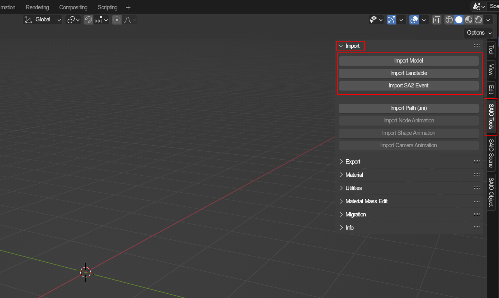

Once your asset is imported, you should be able to start taking a look around it in the 3D view. Please note, some levels may take a second to import as they may have a lot of data to be processed. You may also need to increase your view distance if you would like to see the level without it clipping.

### Example Character import
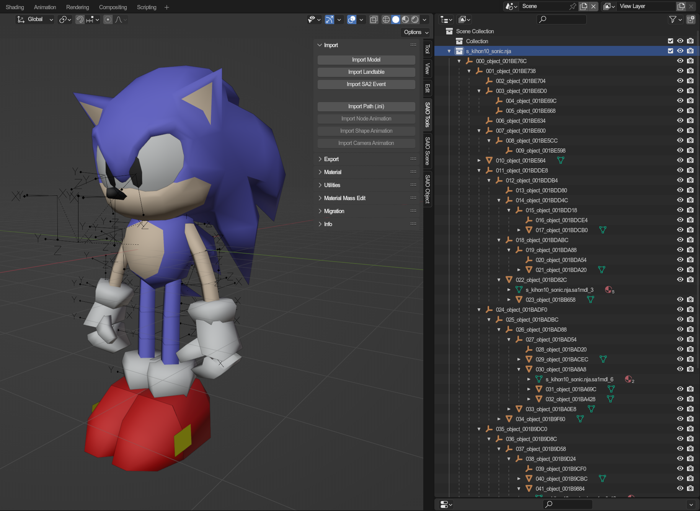

---

### Example Level import
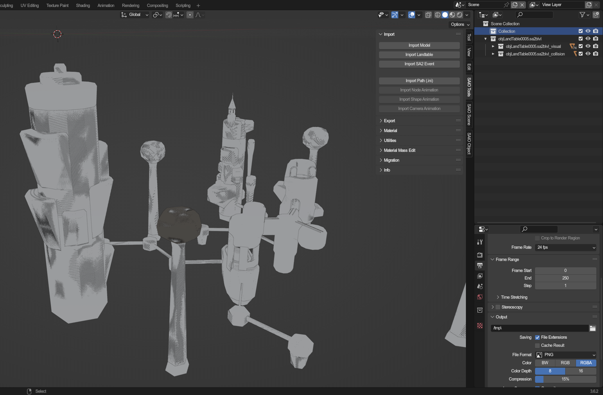

Level imports also come with two types of sub Collections when imported:

- The Visual contains all level models that are rendered when the level is played.
- The Collision contains level models are have their attributes set to solid, but are invisible.

In SA1/DX, your main level will be mostly comprised of Visual objects as it used the level models for both visual and collidable surfaces.

---

## Loading textures
Now that you have your model or stage imported, you probably want the model to have its textures. Thankfully this addon also supports importing and auto-assigning textures.

1. Create a world to hold your texture list for your scene   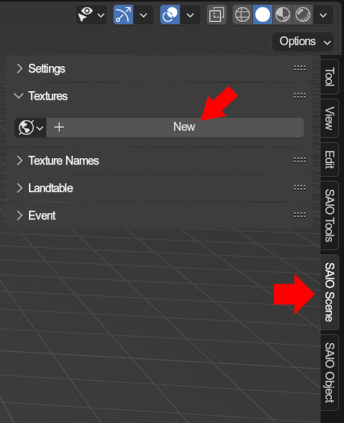
2. Import your texture archive/pack   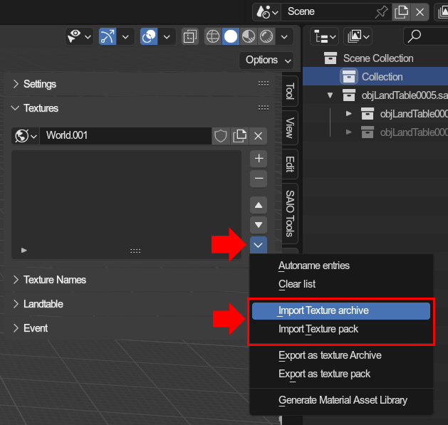
3. Your texture list should now be filled with the textures   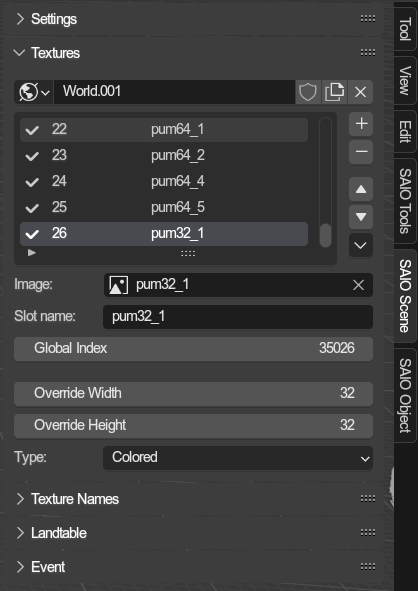
4. Update the material textures   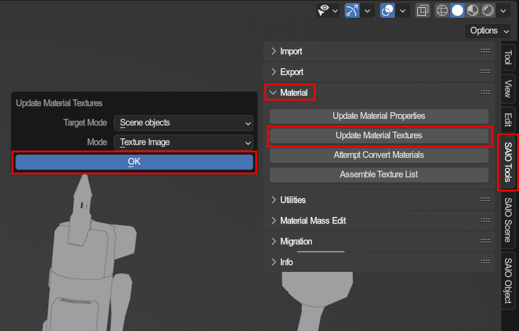
5. View your scene in material view, and you should now be able to see the models with their correct textures*   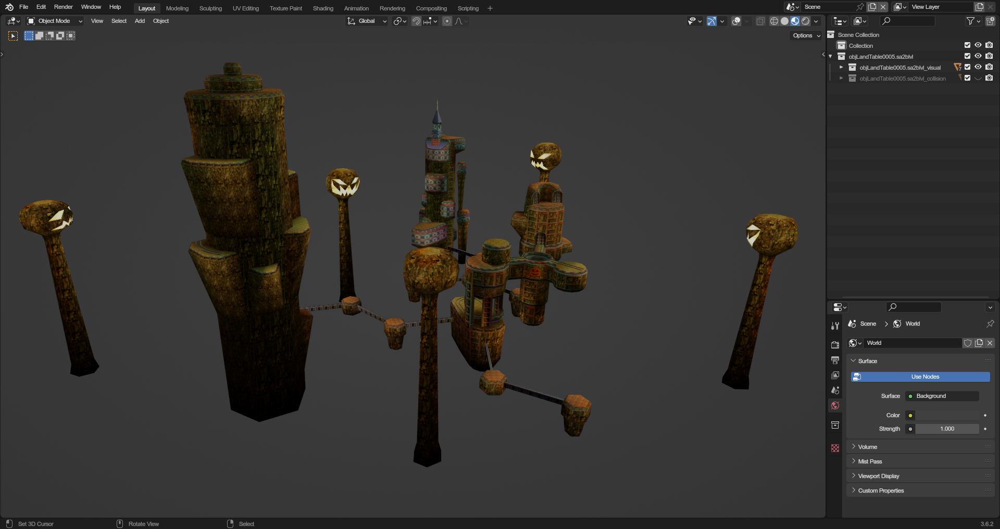

***** Some models, particularly level objects, may need texture name lists to get set up properly.
  For a more in-depth guide on how texturing works, [see this guide](./texturing.md).

---

## Importing Animations
For model files, this tool also supports loaded in animation files.

***The following information is extremely important***
 To import an animation, you will need an object that is set up as an armature. Not all models will import with an armature. Thankfully though, this addon can convert non-armature objects to armatures easily. The following are examples of an armature and non-armature object.

### Example of an armature object
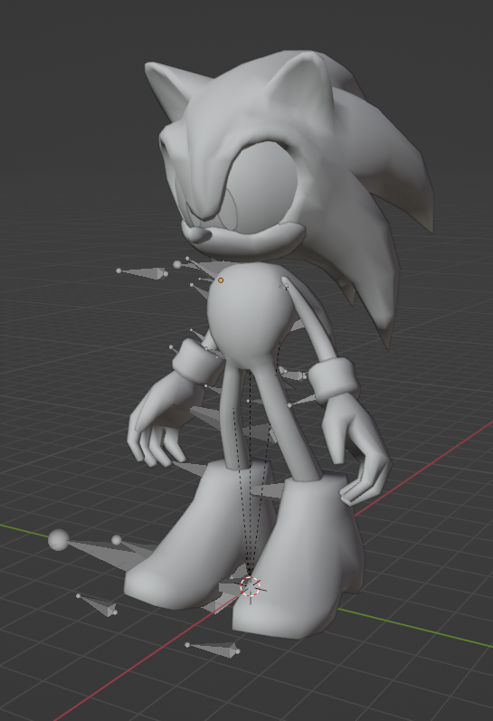

### Example of a non-armature object
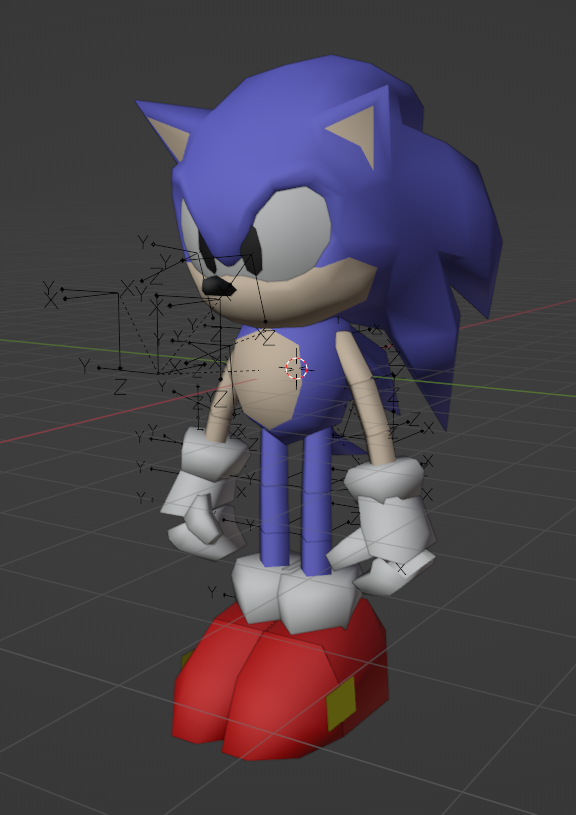

If you have imported a model with (or as) an armature, you can skip to Animation Import. If you do not, please complete the next step before continuing.

## Converting Non-Armature to Armature
To convert a non-armature, simple select the ***root object*** of your object. It will be the very first object in the imported collection.

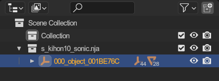

Once selected, go to the tool panel within the SAIO Tools viewport toolbar and select `Armature from objects`:

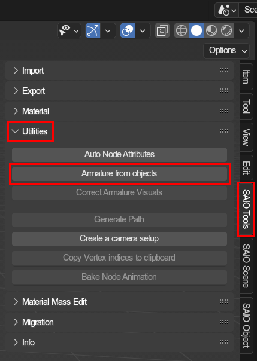

A prompt will open asking your for a rotation mode and if you wish to merge the meshes.

- `Rotation Mode`: Simply leaving this on default (XYZ Euler) is fine.
- `Merge meshes`: This option will merge the mesh data into a single mesh on conversion.

Once you have adjusted the options the way you want them, simply press OK and a new armature containing the mesh data will be created.

### Example output
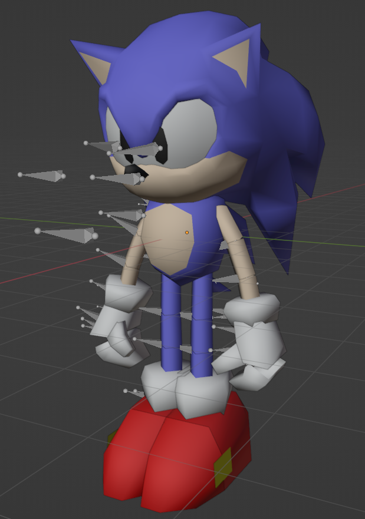

Woohoo! Now you're ready to properly import your animation data to the scene!

## Importing animation files

Now comes the final step, actually importing the animations. Simply select your root object (the Armature).

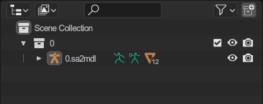

With the armature object selected, simply head to the tool panel within the SAIO Tools Viewport toolbar and use the `Import Node Animation` button.

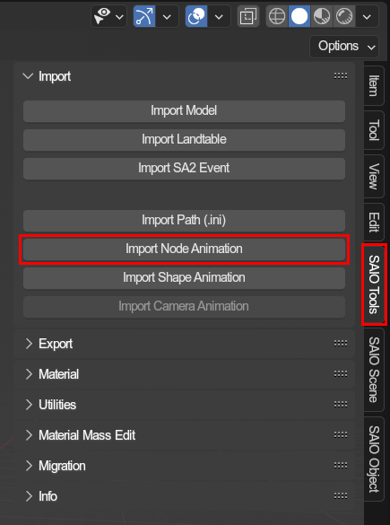

You are able to select as many `.saanim` files as you would like to import. Once you have selected the files you wish to import, press the `Import Node Animation` button in the dialog box to confirm your selection. Afterwards, every animation will be imported to your model as an action with its own NLA track and strip.

To view animations, you can head over to the Animations Workspace in the top bar menu in blender.

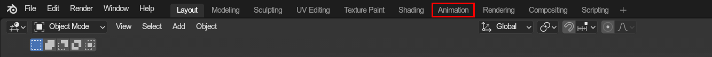

Once there, change the `dope sheet` view to a `Nonlinear animation` view

With your armature still selected, you can see the individual strips that were added. Simply press the star of the track you wish to view and the animation will be played back.

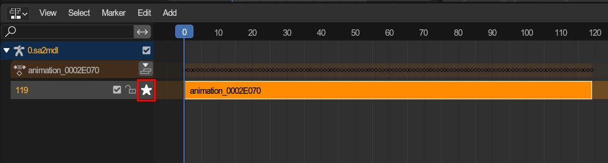

Voilá! The model should now be in the correct pose for the start of the animation! Simply press play and the animation will begin.

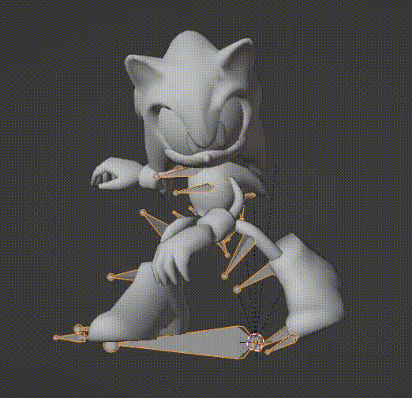