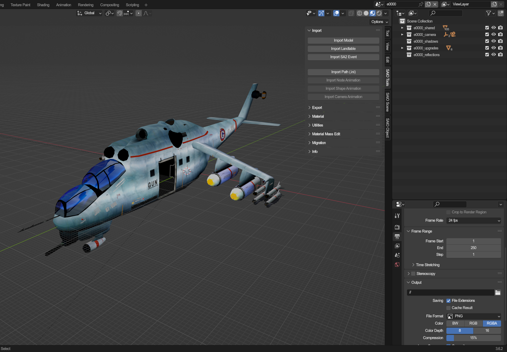
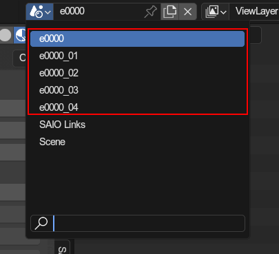
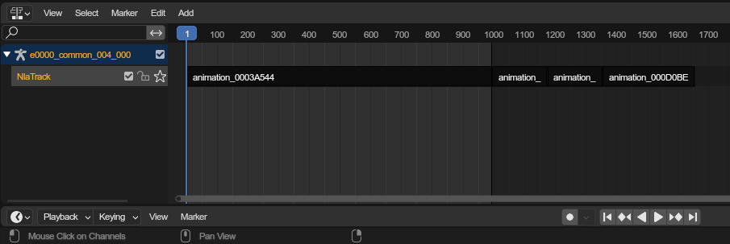

# SA2 Event Editing
SAIO hosts a big new features: **Editing SA2 Events!**

Now you can import and export full events! Mini events, which are played inside stages and utilize ingame models, are planned for the future, and not yet supported.

## Importing events
All SA2 events are located under `Path/To/Sonic Adventure 2/resource/gd_PC/event`, and all have the same naming convention:
  An `e` followed by a 4 digit, zero filled, event number and the `.prs` file extension(e.g. `e0000.prs`).
  Event files are accompanied by other files, storing effects, sounds, subtitles and more, but the only relevant ones for blender are

- `e####.prs`: The main file containing the models
- `e####motion.prs`: Stores animations (only sa2b forward)
- `e####texture.prs`: (optional) Stores the texture list
- `e####texlist.prs`: (very optional) Stores texture names

To import the event, press [`import sa2 event`](../ui/toolbar/tools/import.md#import-sa2-event) and select the `e####.prs` file of your choice.

After importing, you should be greated by something similar to this.

Cutscenes are composed of multiple scenes (the "cuts" of the cutscenes).

There is a Root scene with shared models between the scenes, as well as other objects that are used between the scenes, such as upgrades, shadow models and reflections.

The numbered scenes (`_1`, `_2`, etc.) are the individual animated cuts.

---

## Editing events
Now the question is: What are you allowed to edit?

The answer: **Everything!**
  Full events are completely self contained, and dont depend on any other game models or animations. You can edit them however you like!

*HOWEVER* there are rules you must follow to be able to export the event correctly

---

### Scenes
Events are divided into scenes, as already shown [above](#importing-events).

You can manage which scenes play in which order by editing the [scenes list](../ui/scene/event.md#event-scenes) in the root event properties.

---

### The Root scene
The root scene manages the entire event and stores event entries that get used in every scene. If a model is in the root event, it will not be seperately exported for the other events **and cannot be animated**.

Root events also host the upgrades, shadow models and reflections.

---

### Event Entries
Models in events are called "event entries", and their settings are found under the objects [event entry properties](../ui/object/evententry.md). Only a root object can be an event entry; If an object has a parent, they are not an entry.

---

### Animations
Animations are handled through NLA tracks:

#### Node Animations
The exporter will verify that the animation is "vanilla" (only one track, no modifiers, same length as scene itself, and similar). If the track is vanilla, it will be exported as is; Otherwise the exporter will bake the animation for the entire scene, which will take much longer.

#### Shape Animations
Shape animations are handled a bit different than the regular shape animation export. The addon will require you to align shape animations in your NLA tracks with the scenes start and end, as opposed to naming them all the same. The [curve requirements](./animating.md#limitations) remain the same.

#### Camera animations
Camera animations act similarly to node animations, as they will be baked if not vanilla. As with shape animations, you will not need to ensure their names, as the animations will be derived from which scene they take place in.

---

### Upgrade models
Upgrades are handled a bit tricky. There are 2 types:

#### Override upgrades
These are set in the [override upgrades panel](../ui/scene/event.md#override-upgrades), and will simply make specific parts of a model invisible or visible, based on which upgrades the player has collected.

The base is the visible part when the upgrade is not collected, and the override parts are visible when the upgrade is collected. You are not required to fill any one in. The base and both overrides can be left empty if you so desire.

This is most commonly used for the mechs, as their parts are integrated into the models and simply need to be made invisible.

#### Attach upgrades
Attach upgrades are seperate models that get rendered on whatever they are attached to during the cutscenes. They can be specified in the [attach upgrades panel](../ui/scene/event.md#attach-upgrades).

The model is the model itself, while the target is what they get attached to when the upgrade is collected. **YOU HAVE TO MAKE SURE THE MODEL HAS THE [EVENT ENTRY TYPE](../ui/object/evententry.md#entry-type) `NONE`**, otherwise it will appear in your cutscene as a regular model too!

There are 3 special "upgrades" specifically for events:
- Eggmans windshield
- Tails windshield
- Rouges shoe plates

Those 3 models have been done using upgrades, presumably to correct their transparency effect, and are always enabled/"collected".

---

### Shadow models
SA2B onwards use shadow models to draw shadows in certain cutscenes. For shadow models to work, you must enable [drop shadow control](../ui/scene/event.md/#drop-shadow-control), as well as make sure shadows are not disabled [on event entries](../ui/object/evententry.md#disable-shadow-catching).

Shadow models are set in the [event entry properties](../ui/object/evententry.md#shadow-model), and are basically a mirror of the model that they are attached to. **YOU HAVE TO MAKE SURE THEIR BONES ARE SET UP EQUALLY, OTHERWISE THEIR ANIMATIONS WILL FAIL!** You also have to mark shadow models as such in the [event entry properties](../ui/object/evententry.md#entry-type)

---

### Particles
Particles are simple empty objects with position animations. Their exact properties are specified in the event effects, which an external tool is used for (currently only editable via event splitting).

Particles are marked as such in the [event entry properties](../ui/object/evententry.md#entry-type). Their order is determined by their names.

---

### Reflections
Back in the dreamcast, some scenes utilized reflections, which were basically re-renderings of selected models against a plane. Unfortunately, this is broken in the ports, and has to be fixed with a mod (yet to be made).

Reflections are represented by models with a single plane, sort of like placed mirrors. In their [event entry properties](../ui/object/evententry.md#entry-type), they have to be specified as reflections.

In order for an event entry to be rendered in reflections, you have to mark them as such in the [event entry properties](../ui/object/evententry.md#reflection).

---

## Exporting
Once all is done, you can hit [export](../ui/toolbar/tools/export.md#export-sa2-event) from any scene belonging to the root scene, or from the root scene itself.

Make sure to directly export the files to your mods event folder (`path/to/your/mod/gd_PC/event`) so that the texture archive gets correctly formated (if you do export it).