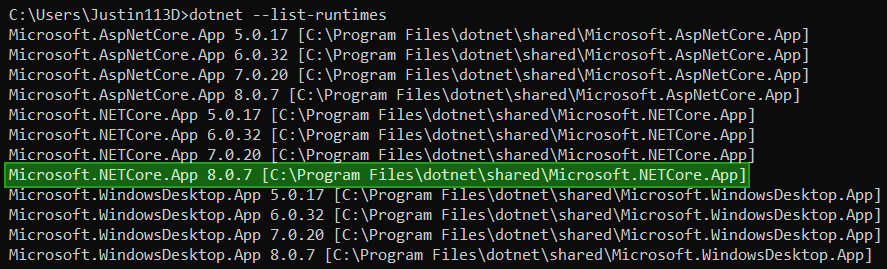

# Installing Sonic Adventure I/O

Installing SAIO is not as straightforward as most other addons. It requires **.NET 8** to be installed, as the addon relies on **C# Libraries** to boost performance and reduce on the amount of code needed to manage. You will have to ensure that you have the **.NET 8 Runtime** installed before being able to use the addon to its fullest.

It's also worth installing **SATools** to be able to obtain and make use of the files that the addon supports.

## Installing .NET 8

If you are unsure of whether your machine already has .NET 8 installed, you can check by opening the console and running `dotnet --list-runtimes`.
  The output should look similar to this:

Notice the line marked in green, `Microsoft.NETCore.App 8.X.X`. if you find this among your installed runtimes, you have all you need!

---

If you don't have the needed runtime installed, head over to [the download page](https://dotnet.microsoft.com/en-us/download) and install the runtime.

!!! note
	The website recommends downloading the **SDK** - the **software development kit**. Unless you are a developer, **you may only want the runtime**. You can head over to ["All .NET 8.0 downloads"](https://dotnet.microsoft.com/en-us/download/dotnet/8.0) and download the Desktop runtime from further below, saving space on your machines storage.

## Installing the Sonic Adventure Toolset

The newest release of SATools can always be downloaded here:

- [SA Tools (x86)](https://mm.reimuhakurei.net/SA%20Tools%20x86.7z).
- [SA Tools (x64)](https://mm.reimuhakurei.net/SA%20Tools%20x64.7z)

Note that the toolset only works on Windows.
It can also update itself, so you will not need to re-download it in the future. Just unpack and store it somewhere where you will find it again.

For more information on the toolset, visit [the wiki](https://github.com/X-Hax/sa_tools/wiki).

## Installing Blender

The Addon is only supported on versions of [Blender](https://blender.org) 4.2 and above.
  A recommendation is to get Blender through [**Steam**](https://store.steampowered.com/app/365670). This will ensure you're always on the latest release version.

## Installing the Addon
The addon utilizes the blender extension system, yet, due to various reasons, we cannot host the addon on the official blender extension repository.
That is why we have set up our own repository under `https://Justin113D.com/blender/saio/`, which will always host the newest release of the addon.

To set up the repository and download the addon, follow these steps:

1. Open blender
2. Open the preferences and open the `Get Extensions` tab
3. Expand `Repositories` on the top right
4. Click the `+` on the top right and select `Add remote Repository`
5. Enter `https://justin113d.com/blender/saio/index.json` for the URL and check `Check for Updates on Startup`
6. Confirm
7. Rename the newly added list entry from `Justin113D.com` to `Sonic Adventure I/O`
8. Select the list entry and change the module from `justin113d_com` to `saio`
9. Press the 🔄 button in the top right to refresh the module
10. Search for `sonic` in the search bar and install the addon

Congratulations! You have successfully installed the add-on!

## Update the addon
1. Repeat steps 1-3 from installation
2. Click  the `V` button in the top right
3. Click the 🔄 button
4. Search for the installed addon in your list
5. Click its "update" button

