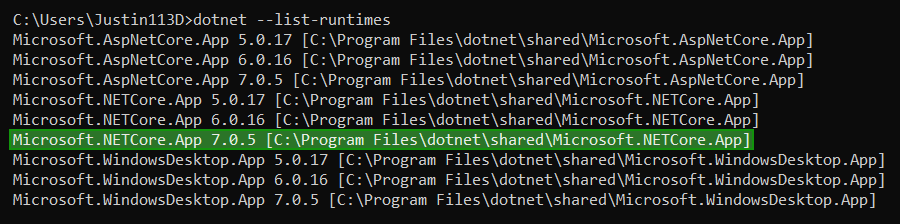

# Installing Sonic Adventure I/O

Installing SAIO is not as straightforward as most other addons. It requires **.NET 7** to be installed, as the addon relies on **C# Libraries** to boost performance and reduce on the amount of code needed to manage. You will have to ensure that you have the **.NET 7 Runtime** installed before being able to use the addon to its fullest.

It's also worth installing **SATools** to be able to obtain and make use of the files that the addon supports.

## Installing .NET 7

If you are unsure of whether your machine already has .NET 7 installed, you can check by opening the console and running `dotnet --list-runtimes`.
  The output should look similar to this:

Notice the line marked in green, `Microsoft.NETCore.App 7.X.X`. if you find this among your installed runtimes, you have all you need!

---

If you don't have the needed runtime installed, head over to [the download page](https://dotnet.microsoft.com/en-us/download) and install the runtime.

!!! note
	The website recommends downloading the **SDK** - the **software development kit**. Unless you are a developer, **you may only want the runtime**. You can head over to ["All .NET 7.0 downloads"](https://dotnet.microsoft.com/en-us/download/dotnet/7.0) and download the Desktop runtime from further below, saving space on your machines storage.

## Installing the Sonic Adventure Toolset

The newest release of SATools can always be downloaded here:

- [SA Tools (x86)](https://mm.reimuhakurei.net/SA%20Tools%20x86.7z).
- [SA Tools (x64)](https://mm.reimuhakurei.net/SA%20Tools%20x64.7z)

Note that the toolset only works on Windows.
It can also update itself, so you will not need to re-download it in the future. Just unpack and store it somewhere where you will find it again.

For more information on the toolset, visit [the wiki](https://github.com/X-Hax/sa_tools/wiki).

## Installing Blender

The Addon is only supported on versions of [Blender](https://blender.org) 4.1 and above.
  A recommendation is to get Blender through [**Steam**](https://store.steampowered.com/app/365670). This will ensure you're always on the latest release version.

## Installing the Addon

1. Download the [latest release](https://github.com/X-Hax/SonicAdventureBlenderIO/releases/). Please make sure to download the `SonicAdventureBlenderIO.zip` asset in the release.
2. Run your version of **Blender**
3. Open the **preferences** and go to the **Add-ons** section
4. Press "**Install...**" in the top right
5. Navigate to the download folder (or wherever you have stored the downloaded .zip file)
6. **Select the .zip file** and press enter.

Congratulations! You have successfully installed the add-on!

The addon features an automatic updater built right into it. If there is an update, the addon will notify you when checking the preferences tab or when hovering over the Addon Info panel in the Viewport panels. The updater code can be found [here](https://github.com/CGCookie/blender-addon-updater). Major thank you to CGCookie for developing this easy to integrate updater under the GPL 3.0 License.