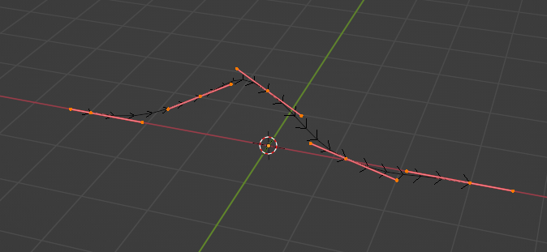
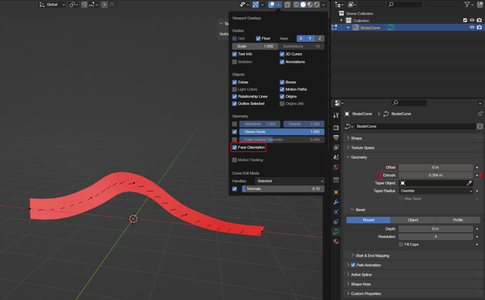
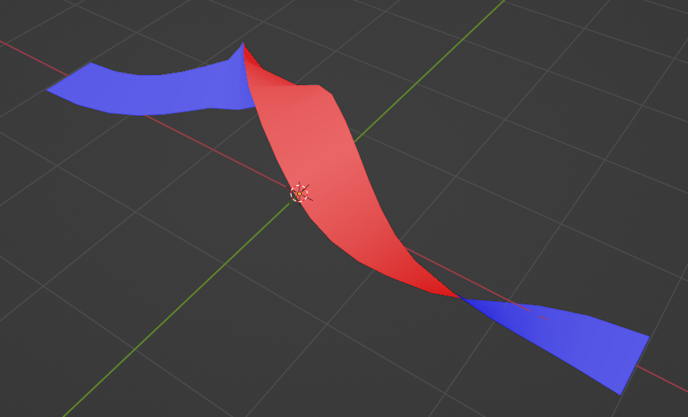
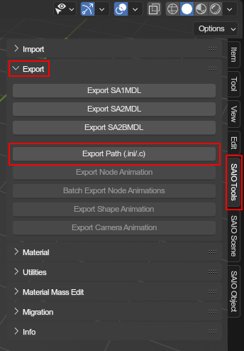

# Path Editing
The addon is capable of importing and exporting paths for use in both Adventure titles. Below is a general guide on how to create a path and then export that path.

## General Path Information
Paths for both games are made up of points and rotations. Splines do store rotations in form of tilts, but those are only visible when rendering with extrude.

## Creating the curve
Paths are made up of bezier curves, so create a bezier curve that you want to export. Below is an example of a curve that one might want to export.

To view the "up" side of the curve, increase the `extrude` of the curve and enable `Face Orientation` in the viewport overlays. The Blue side is "up".

You can use the `Ctrl + T` hotkey to twist the selected bezier points.

## Exporting the path

Now its ready for exporting. With the curve selected, go to the SAIO viewport toolbar and select Export Path

Pressing the button will bring up a File Save dialog with 2 drop downs on the right.

The first drop down will let you choose how to format the path:

- `Ini` can be used in project managers and can be imported again
- `C struct` exports in a C formatted structure that can be directly included in your mod project code.

The second drop down will allow you to select a preset code address to use in your export. The existing options are for loops in both SA1 and SA2. SA2 also includes grind rails and hand rails that are seen in Crazy Gaget. This list may differ from what is currently selectable as more options may be added in the future.

