# Texturing

The addon features full texture support, including texture list processing and importing and exporting of texture archives.

## Texture lists
The Sonic Adventure games primarily access textures (be it on models, as ui sprites other other) using [Textures lists stored in Archives](../assetinfo/filetypes.md#textures). A texture is then referenced by it's index within the list, or by the global texture index. SAIO has full* texturing support that allows for viewing all models with textures.

***** Some object models compile textures from multiple different texture lists. This is has yet to be implemented into the addon, but can already be worked around.

---

### Importing & Exporting

The addons allows for directly importing and exporting [most texture archives formats](../assetinfo/filetypes.md#textures).

<b>Importing: Click for step by step guide</b>

1. Navigate to the texture list panel for which you want to import the texture list.
2. Select or create the world that should hold the texture list.
3. Click the tiny arrow to the bottom right of the list.
4. Click `Import texture archive`/`Import texture pack`.
 [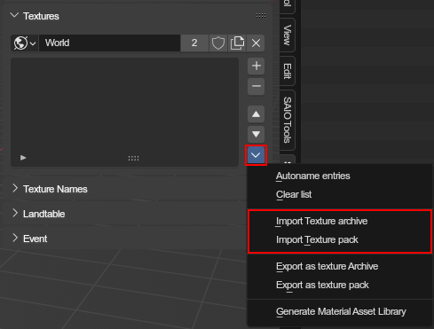](../img/textures_import_1.png)
5. Select the archive/pack index file.
6. Click the blue confirm button in the bottom right to start importing.
 [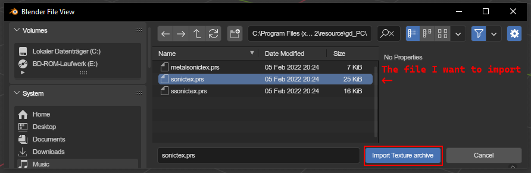](../img/textures_import_2.png)
7. Wait until the import is complete.
8. Your texture list should now have more textures.
 [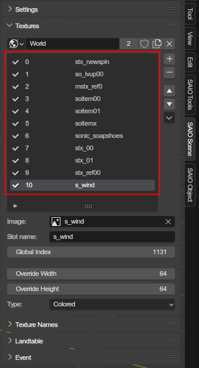](../img/textures_import_3.png)

<b>Exporting: Click for step by step guide</b>

1. Navigate to the texture list panel of which you want to export the texture list.
2. Click the tiny arrow to the bottom right of the list.
3. Click `Export texture archive`/`Export texture pack`.
 [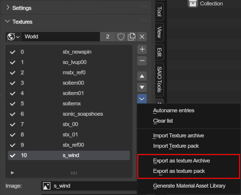](../img/textures_export_1.png)
4. Choose the format in which you want to export the texture list, and whether to compress it with PRS.
5. Select a folder to export the textures to and enter the file/pack name.
6. Click the blue confirm button in the bottom right to start exporting.
 [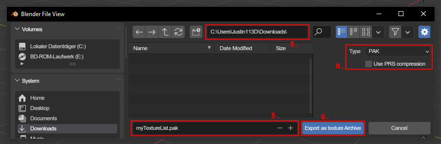](../img/textures_export_2.png)
7. Wait until the texture list is exported.
8. The texture archive/pack should now be visible in the output folder.
 [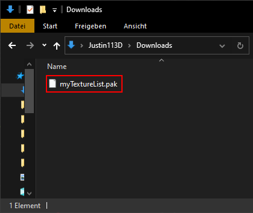](../img/textures_export_3.png)

---

## Texture name lists
Texture names are used to "convert" material indices. They are primarily used for objects that share texture lists with other objects and require a specific subset of textures to be used. In that case, you'd use a texture name list on the object (or scene), which would take the materials texture index, get the texture name from its list, and look for a texture with the same name in the texture list.

<figure markdown>
[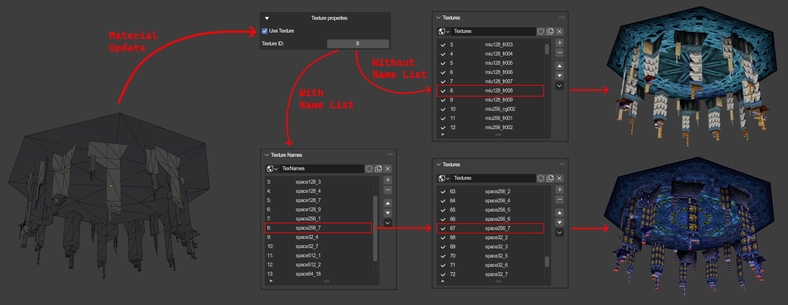](../img/textures_texname_explanation.png)
<figcaption>A diagram depicting how texture names influence texture evaluation</figcaption>
</figure>

---

### Importing & Exporting
The addon allows for importing and exporting texture lists

<b>Importing: Click for step by step guide</b>

1. Navigate to the texturename list panel for which you want to import the names.
2. Select or create the world that should hold the names.
3. Click the tiny arrow to the bottom right of the list.
4. Select `Import texture list`.
 [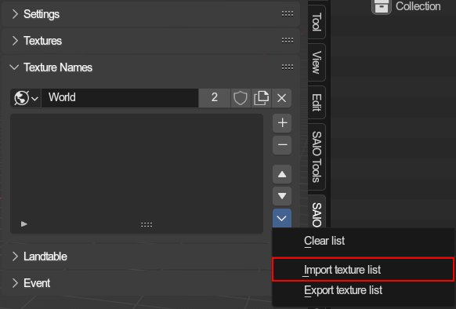](../img/textures_names_import_1.png)
5. Select the ini/satex file.
6. Click the blue confirm button in the bottom right to initiate the import process.
 [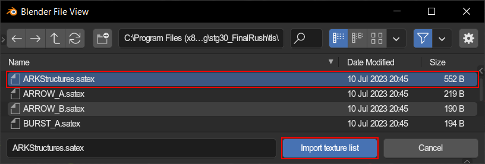](../img/textures_names_import_2.png)
7. Wait until the import is complete.
8. Your texturename list should now have more names.
 [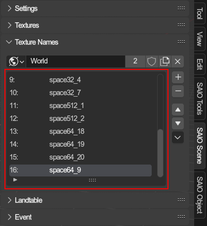](../img/textures_names_import_3.png)

<b>Exporting: Click for step by step guide</b>

1. Navigate to the texturename list panel of which you want to export the names.
3. Click the tiny arrow to the bottom right of the list.
4. Select `Export texture list`.
 [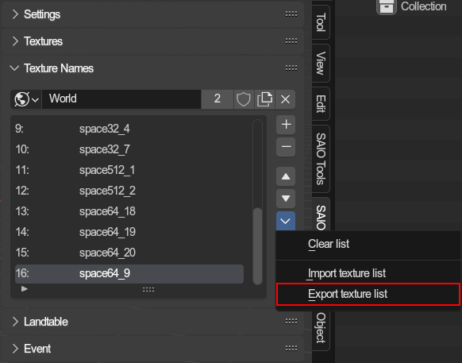](../img/textures_names_export_1.png)
5. Select a folder to export the texturename list to and enter the filename.
6. Click the blue confirm button in the bottom right to start exporting.
 [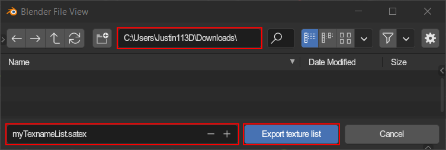](../img/textures_names_export_2.png)
7. Wait until the export is complete.
8. Your satex file should now be visible in the output folder.
 [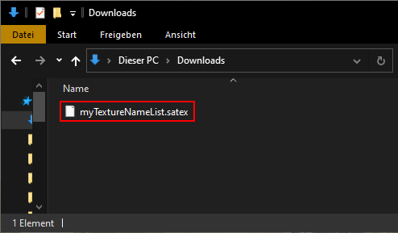](../img/textures_names_export_3.png)

---

## Texture management

### Managing your lists

Texture lists and Texturename lists can be set for on **scenes** and **objects**. Lists are stored on worlds, which allows for reusing lists between scenes and/or objects. This also means that you have to create a world for each list you want to use. Texture lists and Texturename lists occupy different spaces on a world, which means that every world can have a texture list and a texturename list, but you are not forced to use a world for both at once.

It is recommended to use a world for only either a texture list or texturename list, to keep things organized.

See more about how to [edit **texture** lists here](../ui/textures.md) and how to [edit **texturename** lists here](../ui/texturenames.md).

### Updating textures on materials
You will need to update the material using an operator. The only times textures will automatically be applied is when

- you import a model or level to a scene that already has a texture list with the necessary textures
- importing events, as event importing will automatically import textures needed and apply them

To update material textures, you will have to navigate to use the [Update Material Textures](../ui/toolbar/tools/material.md#update-material-textures) operator. Make sure that its set to `Texture Image` mode, so that the images on texture will be updated.

### Manually setting a materials texture

You can set textures in two ways: Either by setting the [texture ID](../ui/object/material.md#texture-id), or by selecting a texture via the [texture slot](../ui/object/material.md#texture) (requires material to be set up).

### How textures/indices get picked

!!! note
	Unless you are setting up a complex scene with many texture lists and reused materials, you probably won't need to understand this process to its fullest.

Texture lists and texturename lists can be attached to scenes and objects. This means that a material has to find its appropriate texture list and texturename list of which to use the textures and their indices when trying to map textures to indices and vice versa. The process for finding a material texture list and name list is the same.

This means for every material to get the texture/id for, every mesh, object and the parent objects are checked for the lists. For every object on which the material is located on, the first lists are picked. If a material is reused between objects that result in different lists, it falls back to the lists of the scene that the evaluation is currently happening on. If the scene has no lists, none will be used at all.

When trying to obtain a materials texture ID (like when exporting a model), the addon will get the list and look for the texture image. If a texture name list was found, it will look for the name of the corresponding texture item there, and use the given ID if found.
 If the ID is not retrievable that way, the addon will just use the manually set fallback ID.
 This same process also works the other way around, when looking for the texture of a material by the fallback id.

---

The list finding process may be a bit hard to wrap your head around, so lets look at some graphs:

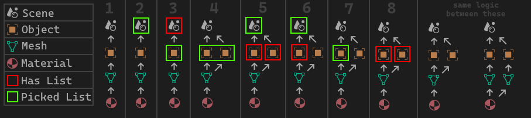

This graph shows where and how lists get picked. The logic is the same for textures and texturenames. Following cases:

1. **NO LIST**: No list is found at all. Fallback is used
2. **HAS LIST**: A list is found on the scene.
3. **HAS LIST**: A list is found on the object and on the scene, but the object has priority
4. **HAS LIST**: The material is found on two objects, and both use the same list, so its used.
5. **HAS LIST**: The material is found on two objects, but both use different lists, so the list found on the scene is used
6. **HAS LIST**: The material is found on two objects, but even though only one has a list, the scenes list gets used.
7. **HAS LIST**: The material is found on two objects, and only one object hast a list. Since no other list is found for the material, that one is used.
8. **NO LIST**: The material is found on two object, but both have different lists, and the scene has none to fall back onto, so none is used.

