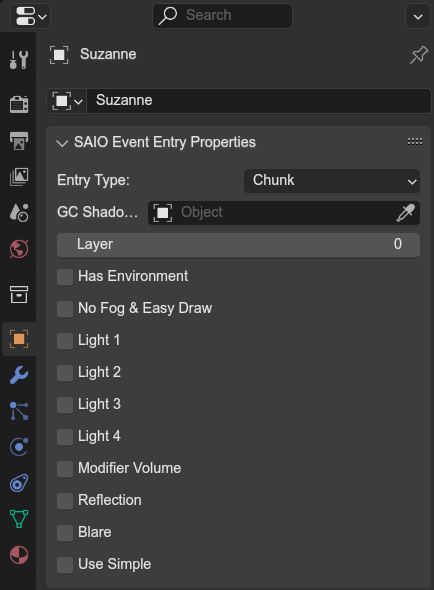

# Event Entry Properties Panel
{ align=right }

In event scenes, this panel is used to set event geometry properties and to define how the model behaves during cutscene playback.
  The panel is only available for the top-level parent of a model. Any object with a parent will not be able to use this panel.

The panel can be found in the **properties** editor, under the **object** tab, called "SAIO Land Entry Properties".

 

!!! Note
	Some event entry properties have been changed with SAIO version 2.2.1. If you are continuing work on an old event project, make sure to [Migrate Update Data](../toolbar/tools/migration.md#migrate-update-data)

---

## Entry Type

- `None`: Not any event structure. Use this on objects that should not be exported, such as cameras or other workflow objects.
- `Chunk` & `GC`: A model that is rendered and animated.
- `Shadow`: A GC Shadow model and lets it be used in the **GC Shadow Model** property.
- `Particle`: A particle object.
- `Reflection Plane`: A reflection plane model. The object is expected with only a single quad.

## CHUNK & GC Models
These two types are exported as actual models in the event. The types export the model corresponding to their name (read more [here](../../assetinfo/model_formats.md)).

Additionaly, these get extra attributes to set, documented below.

### Shadow Model
You can set a shadow model to be used for GC shadow casting. **MAKE SURE THE ARMATURE IS SET UP IDENTICALLY**, as the exact same animation will be applied as to the base model!

### Layer
This was added in the ports, and is used to adjust the rendering order for transparent models. Increasing the layer makes the model draw later then those at lower layers.

### Has Environment
Has env mapped materials, use Simple variant of draw function

### No Fog & Use Easydraw
Draw with fog disabled and use EasyDraw

### Light 1 - 4
Enables multi-light of the given index

### Modifier volume
Is a modifier volume and should use ModDraw

<figure class="align-right" markdown>

<figcaption>How the Blare Effect should've looked like;  Via the SA2 Cutscene player tool</figcaption>
</figure>

### Blare
Marks the model to be used in the blare effect, an unused and unfinished effect similar to motion blur. The name originates from the games debugging texts.
 Only 64 models can be marked for blare.
 

### Reflection
Marks the model to be visible in reflections.

### Use Simple
Use regular Simple over any Multi or Easy variant

!!! Notes
	- `DrawMotion` and `DrawShapeMotion` are decided based on if the motion and shape data are present, with shape requiring both.
	- `EasyDraw` variants don't support environment maps, diffuse on textured materials, or backface culling. It is the fastest draw function on DC
	- `SimpleDraw` variants support env maps and backface culling, but not diffuse on textured materials. On env mapped materials, `Simple` applies diffuse, but `SimpleMulti` does not.
	- `MultiDraw` allows for multiple lights, up to 6 (events use 4), to be used on a single model; otherwise only 1 light can be used. Both `Multi` and non-`Multi` functions use only 1 ambient value, but `Multi` supports an arbitrary ambient color while non-`Multi` functions only support the ambient being a multiple of the light color.
	- If a model has any of the Light attributes it will use `MultiDraw`, if it has none it will use the non `Multi`
	variant with light 1
	- `No Fog & Use Easydraw` only works for models with no motion data, and overrides the `Has Environment`, `Use Simple`, and `Light` attributes
	- `Modifier volume` overrides everything
	- `Use Simple` is the strangest of the attributes, as everything in the base scene seems to use it, even if it also uses `No Fog & Use Easydraw` or even a `Light` attribute. It's not a `STATIC` attribute, as some entries use it even though they are animated, it's not a `NOMULTI` attribute as most other entries just disable all the `Light` attributes, and it's not a back face culling thing either as `No Fog & Use Easydraw` forces EasyDraw and skyboxes often use both.