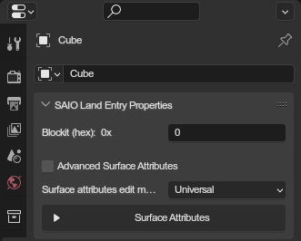
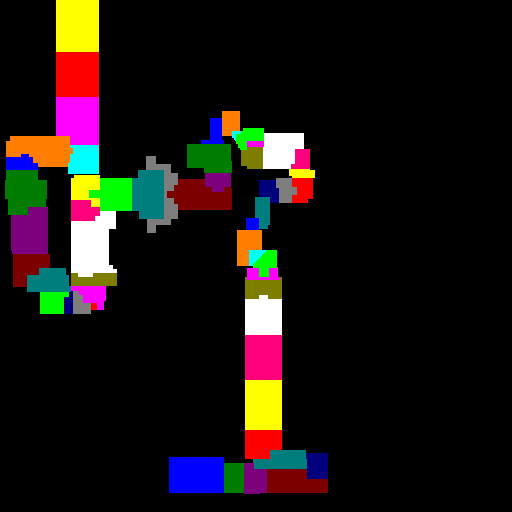

# Land Entry Properties Panel
{ align=right }

In landtable scenes, this panel is used to set level geometry properties and to define how the model behaves during gameplay.

The panel can be found in the **properties editor**, under the **object** tab, called "SAIO Land Entry Properties".

 

---

### Surface Attributes
These define how a model is rendered and collided with. Both SA1 and SA2 have different sets of surface attributes to accomodate for different functionalities between the games, but many are shared.

By changing the edit mode (**Universal** by default), you can change which attributes you want to see and edit, making it easier to manage surface attributes for a specific game.

TODO: Document all attributes here

### Blockbit

<figure class="align-right" markdown>
{ width=256 }
<figcaption>Blockmap for city escape</figcaption>
</figure>

This is a hexadecimal [**bitmask**](https://en.wikipedia.org/wiki/Mask_(computing)) that is used by Blockmaps. Blockmaps help the adventure games render larger levels by grouping geometry together in blocks and processing only the geometry associated with the block that the player is currently inside. The blockbit defines which blocks the object is part of, each bit defining a single group (allowing for a total of 32 blocks).

In coding, each bit is assigned a color, which are then used in a blockmap image. The game then looks up which pixel in the map the player is located in, and will only process geometry which have set the corresponding bit as the pixels color.