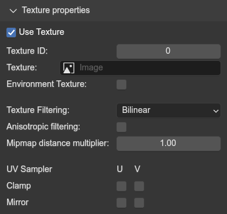
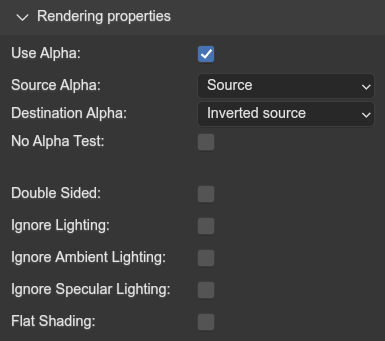

# Material properties
{ align=right }

Every material now has a new menu added with the name `SAIO Materia Properties`, which is used for setting material properties used on export.

 

---

## General Properties

### Diffuse Color
The lit surface color.

### Specular Color
The specular color for when reflecting light. Only works in SA1 (by default).

### Ambient Color
The base/unlit surface color (basically "shadow" color).

### Specular Strength
How sharp the specular reflection should be. Lower value = smoother hotspot, while higher values = sharper hotspot.

---

## Texture Properties
{ align=right }

Properties related to applying textures to the model surface.

 

### Use Texture
Whether textures should be used. If disabled, the other texture properties get grayed out (but are still interactable).

### Texture ID
An index referring to a texture in the models texture list. Gets ignored if a texture image is set, but acts as fallback in case no texture ID is found for the image.

### Texture
A direct inclusion of a texture dropdown selection for the materials texture node. Will override the texture id if possible.

### Environment Texture
Instead of using a UV map, the game will use normals and the camera view to decide how to choose how to render the texture. It is used for reflection maps or similar, very comparable to Blenders Matcap view mode. **Does not work for SA2B**.

### Texture Filtering
The texture filter mode to apply ingame.

- `Nearest Neighbour`: No filtering at all (sharp pixels)
- `Bilinear`: Bilinear filtering (transitioning between pixels)
- `Trilinear`: Trilinear filtering (transitioning between pixels **and** mipmaps)
- `Blend`: Bi- and Trilinear filtering blended together (???)

### Anisotropic filtering
Also known in the game as "Super sampling". May not properly work.

### Mipmap distance multiplier
Increases the distance threshold between the model and camera at which the mipmap level increases.

### UV Sampler
For clamping and mirroring the uv channels.

---

## Rendering properties
{ align=right }

Various rendering properties to alter how the shading gets calculated for the material.

 

### Use Alpha
Makes use of the alpha properties in the texture and diffuse color to render the material transparent

### Source & Destination Alpha
Determines the GPU math used for blending alpha blending.

Common Combinations (Source & Destination):

- `Source` & `Inverted Source`: Default transparency
- `One` & `One`: Additive blending
- `Destination` & `Zero`: Multiplicative blending

Read more [here](https://www.learnopengles.com/android-lesson-five-an-introduction-to-blending/)

### No Alpha Test
Disables alpha testing (essentially ignored whether a pixel is fully opaque and does all transparency math involved).

### Double Sided
Essentially "Backface Culling" but inverted. The games dont properly support this (unless you use mods that fix it).

### Ignore [shading property]
Excludes the various colors from the lighting calculations. Behave differently in each game.

### Flat Shading
Ignores vertex normals and instead uses "flat" polygon normals.

---

## SA2B Specific
{ align=right }

These properties are exclusive to SA2B models.

The texture coordinate properties are used for changing how UVs apply, like using Environment mapping.

 

Common setups:

| **Setup**           	| **Output** 	| **Type**   	| **Matrix** 	| **Source** 	|
|---------------------	|------------	|------------	|------------	|------------	|
| Default             	| Texcoord0  	| Matrix 2x4 	| Identity   	| Tex0       	|
| Environment mapping 	| Texcoord0  	| Matrix 3x4 	| Matrix 4   	| Normal     	|

---

### Shadow Stencil
Changes how the shadows intersect (?)

### Texgen coord output slot
The texture channel to which these properties apply. Only `TexCoord0` works

### Texgen type
The math used to alter the uvs (?)

### Texgen Matrix ID
Which matrix should be used to alter UVs

### Texgen source
The data to use as source