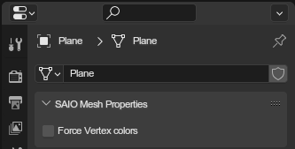

# Mesh Properties
{ align=right }

Mesh related properties.

 

---

### Force vertex colors
If you have a model with multiple vertex weights the addon will export it with normals, regardless of whether it has color attributes or not. This is because the SA2 mesh format doesn't allow for smooth weights and vertex colors to be combined (or rather, the games do not support it).

Forcing vertex colors will export the model with binary weights (each vertex will be tied to a specific bone) to keep the vertex colors on it.

### Texcoord precision level
Some export formats allow for increasing the precision of texture coordinates in exchange for reduced range.
  Increasing the level by one gives you double the precision of the previous level, but reduces the available range by half.

Each format has a different supported precision level range:

| Game 	| Format 	| Range                       	|
|------	|--------	|-----------------------------	|
| SA1  	| BASIC  	| 0 - Allows for no precision 	|
| SA2  	| CHUNK  	| 0 or 2                      	|
| SA2B 	| GC     	| 0 through 7                 	|

On import, the precision level is currently only maintained for SA2B/GC.