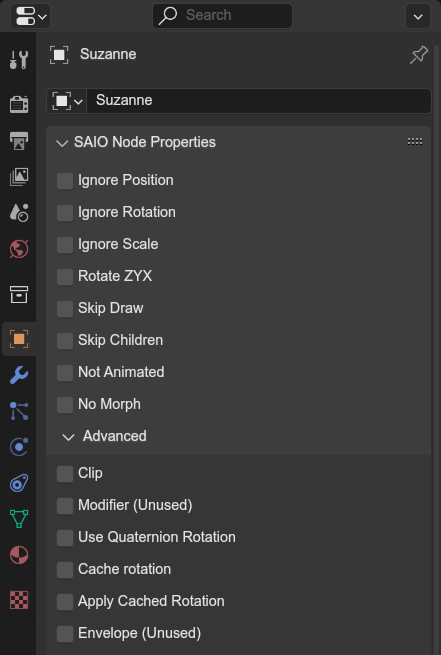

# Node Properties Panel
{ align=right }

Objects and bones are considered nodes and own attributes related to them, which the sonic adventure games use to determine how to evaluate them during runtime.

The panel can be found in the **properties editor**, under the **object** and **bone** tabs, both called "SAIO Node Properties".

 

!!! info
	The following attributes dont need to be set by hand and can be evaluated at export time:

	- Ignore Position
	- Ignore Rotation
	- Ignore Scale
	- Skip Draw
	- Skip Children

---

### Ignore Position / Rotation / Scale
Settings these makes the game ignore the transform channels of the same name.
  These get ignored when animating respective channel.

### Rotate ZYX
In case the default rotation order (XYZ) does not achieve necessary results, you can flip the rotation order so that the game first applies Z, then Y and lastly X.

### Skip Draw
The game will ignore any attach data on the node and not render it. Required by the game if the node has no attach data.

### Skip Children
The game will ignore any children of the node. Required by the game if the node has no children.

### Not Animated
When set, this node will be completely ignored during **node animation** evaluation, essentially skipping an index when encountered.

### No Morph
The same as **Not Animated**, but for morph animations.

### Clip
If the mesh bounds are out of view, skip the children

### Modifier (Unused)
An unused attribute. May be used in Render Fix in the future.

### Use Quaternion Rotation
Use quaternion vectors for rotating instead of euler angles. (SA2 only)

### Cache rotation
Cache the rotational matrix for later use.

### Apply cached rotation
Use the cached rotational matrix.

### Envelope (Unused)
Unused attribute