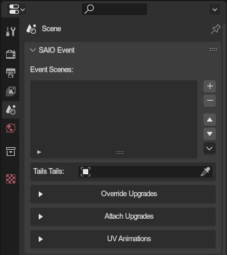
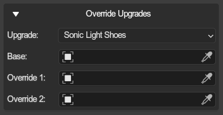
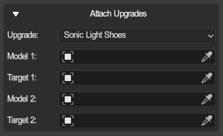
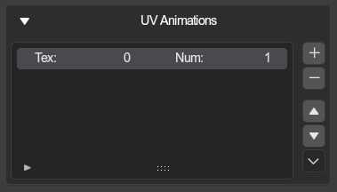

# Event Properties
{ align=right }

Event properties, only available on the root event scene.

 

---

## Event Scenes
Events are composed of multiple animated scenes, which the addon translates to literal scenes. This list is for specifying which scenes and in which order they are played and exported.

## Drop Shadow Control
When enabled, shadow models will cast shadows.

---

## Tails Tails
Events allow for specifying an object or a bone as "tails tails", which will then animate the tails with a procedural vertex displacement animation.

---

## Integrated Upgrades
{ align=right }

Integrated upgrades let you hide and show specific models for when an upgrade is used. This is primarily used for Mech Parts, but can be used for all upgrades.

 

### Base
Gets hidden when upgrade is enabled

### Integrated 1 & 2
Get shown when upgrade is enabled

---

## Overlay Upgrades
{ align=right }

Overlay upgrades take a model and renders them attached to a node. This is used for upgrades like sonics light speed shoes, Knuckles hammer gloves, and so on.
  Will not only hide model itself, but also its children.

### Model 1 & 2
The model that gets overlaid

### Target 1 & 2
The node to which the respective model should be attached to

 

---

## Texture Animations
{ align=right }

Specifies Texture ranges for animations. Then, any material referenced by [Event node UV Animations](../object/event_node_uv_animations.md) that uses a texture in the sequence.

### Tex
The start texture index

### Num
Textures in the sequence