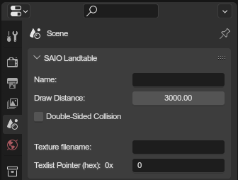

# Landtable properties
{ align=right }

These are properties specific to landtable file.

 

---

### Name
The name of the landtable (file metadata)

### Draw Distance
Draw distance to be used ingame. Default value of 3000

### Double Sided Collision
If enabled, collision can be collided with from the "inside" too. Otherwise only from the "outside".

### Texture Filename
The name of the texture file to use.

### Texlist Pointer
The RAM address of the texture list to use.