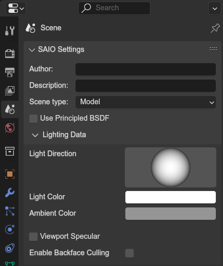

# Scene settings properties
{ align=right }

Various scene settings to tell blender how the scene is intended to be used.

 

---

### Author
File metadata of who made the file

### Description
File metadata of what the file contains

### Scene Type
Type of scene, which enables or disables various menus across the addon.

- `Model`: Default scene type; Does not enable anything.
- `Landtable`: Landtable scene type; Enables the
	- [Scene landtable panel](./landtable.md)
	- [Landentry properties panel](../object/landentry.md)
- `SA2 Event Root`: Marks the scene as the root event scene and enables the
	- [Event properties panel](./event.md)
	- [event entry properties panel](../object/evententry.md)
	- [event node uv animations panel](../object/event_node_uv_animations.md).
- `SA2 Event Scene`: Marks the scene as an animated scene belonging to a root scene and enables the
	- [event entry properties panel](../object/evententry.md)
	- [event node uv animations panel](../object/event_node_uv_animations.md).

### Use Principled BSDF
Will use blenders builtin Principled BSDF node for shading. Especially useful for when exporting models to another format, so that textures and a few other properties are kept.

## Lighting Data
Scene wide viewport rendering properties. Do not affect any export.

### Light Direction
The direction from which the light should come (drag the sphere).

### Light Color
The diffuse light color.

### Ambient Color
The ambient light color.

### Viewport Specular
Whether specular highlights should be rendered

### Viewport blend mode
The viewport blending mode for addon materials.

### Enable backface culling
Whether to use backface culling for addon materials that dont use double sided rendering.