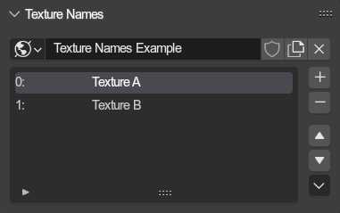
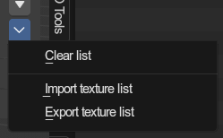

# Texturename List
{ align=right }

The sonic adventure games utilize texture name lists to select textures from various texture lists and draw them on the model. The addon has full support for this via texture name lists. The texturing process is documented [here](../guides/texturing.md).

The texturename list uses the [common list setup](./lists.md).

They are found on Scenes and Objects, and are stored within worlds.

 

---

## Texturename slots (Items)
Items in a texture name list have only one property: The name, which you set directly from the list view. To its left you see the index inside the texture name list.

## Operator menu
{ align=right }

There are various utilities for texturename lists in the drop down menu next to the list

 

---

### Clear list
Removes all texture slots from the list.

---

### Import texture list
Imports a texture list (.satex, .ini).

### Export texture list
Exports a texture list (.satex).