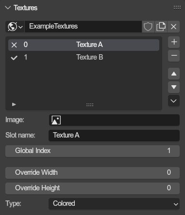
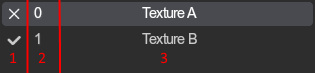
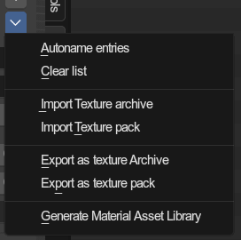

# Texture List
{ align=right }

The addon stores textures for materials inside lists, just like the games do with textures archives. The texturing process is documented [here](../guides/texturing.md).

The texture list uses the [common list setup](./lists.md).

They are found on Scenes and Objects, and are stored within worlds.

 

---

## Texture slots (Items)
The list displays following properties in the item boxes:

**1:** Whether the texture slot has an image assigned.
 **2:** The ID of the texture slot within the list.
 **3:** The name of the slot, as it is exported.

---

## Texture properties
Every texture slot holds various properties:

### Image
The image texture to use

### Slot name
The name of the texture slot, and the name of the actual texture in the exported texture pack/archive.

### Global Index
The global texture index. The games do not really (or improperly) use them.

[SA1 DX Global Index list](https://mm.reimuhakurei.net/misc/sadx_gbix.txt)
 [SA2 PC Global Index list](https://mm.reimuhakurei.net/misc/sa2pcgbix.txt)

### Override Resolution
Used in texture packs for when you want to replace a texture with a higher resolution one. The override width and height is then used to store the original texture resolution and used for replacing the texture ingame, as the game expects a specific texture size.

### Type
Declares the image as a specific texture type. Indexed textures are mostly used for things like chao textures.

- `Colored`: Regular RGB(A) texture.
- `Index4`: 4 bit index texture for paletts of up to 16 colors.
- `Index8`: 8 bit index texture for paletts of up to 256 colors.

---

## Operator menu
{ align=right }

There are various utilities for texture lists in the drop down menu next to the list

 

---

### Autoname entries
Automatically names the textures slots in the list after the names of the images assigned to them. If no image is provided, the previous name will remain.

### Clear list
Removes all texture slots from the list.

---

### Import texture archive
Imports a texture archive.

Supported formats:

- `.pak`
- `.gvm`
- `.pvm`
- `.pvmx`
- `.prs` (any of the above compressed)

### Import texture pack
Imports a texture folder pack.

---

### Export as texture archive
Supported formats:

- `.pak`
- `.gvm`
- `.pvm`
- `.pvmx`
- `.prs` (any of the above compressed)

### Export as texture pack
Exports to a texture folder pack.

---

### Generate Material Asset library
Generates a material for each texture and stores them in a new asset library
