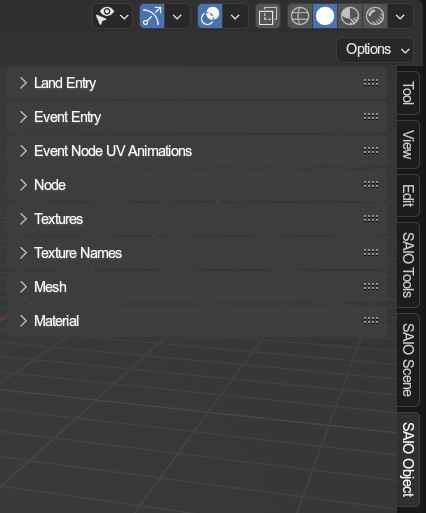

# SAIO Object
{ align=right }
Object related panels all in one place. All of these can be found in the properties tabs, and display what data is targeted.

 

---

### Land Entry
References the [land entry properties panel](../object/landentry.md) of the currently active object.

### Event Entry
References the [event entry properties panel](../object/evententry.md) of the currently active object.

### Event Node UV Animations
References the [event node uv animations panel](../object/event_node_uv_animations.md) of the currently active object or bone.

### Node
References the [node properties panel](../object/node.md) of the currently active object or bone.

### Textures
References the [texture list](../textures.md) of the currently active object.

### Texture Names
References the [texturename list](../texturenames.md) of the currently active object.

### Mesh
References the [mesh properties panel](../object/mesh.md) of the currenlty active object.

### Material
References the [material properties panel](../object/mesh.md) of the currenlty active material on the currently active object, as well as display the objects material lists.