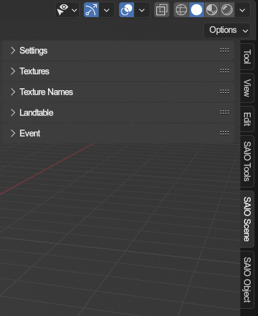

# SAIO Scene
{ align=right }

References to scene property panels.

 

---

### Settings
References the scenes [settings properties](../scene/settings.md)

### Textures
References the scenes [texture list](../textures.md)

### Texture Names
References the scenes [texture name list](../texturenames.md)

### Landtable
References the scenes [landtable properties](../scene/landtable.md)

### Event
References the scenes [root event properties](../scene/event.md)