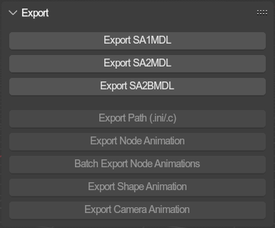
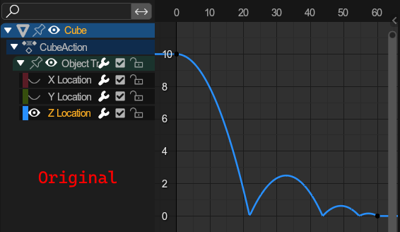
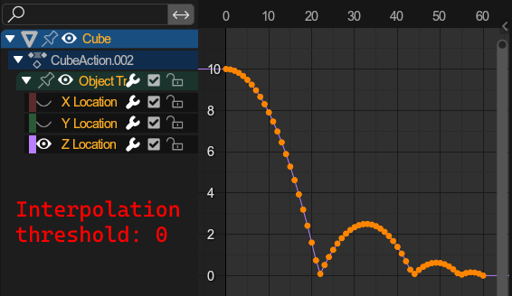
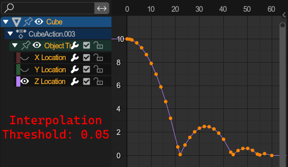
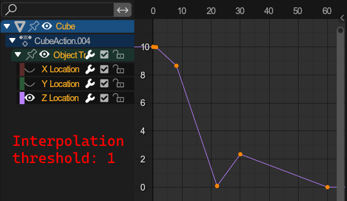
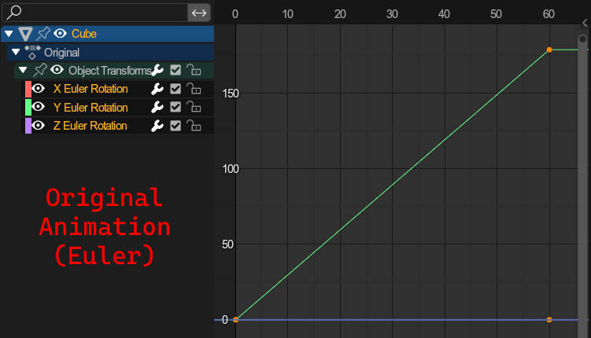
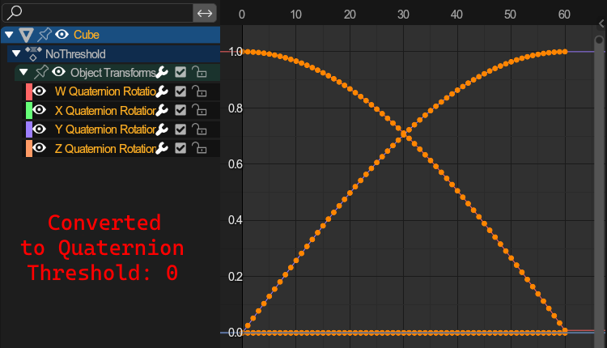
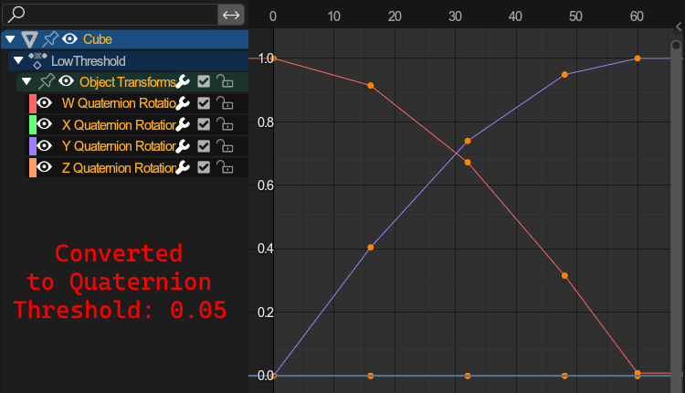
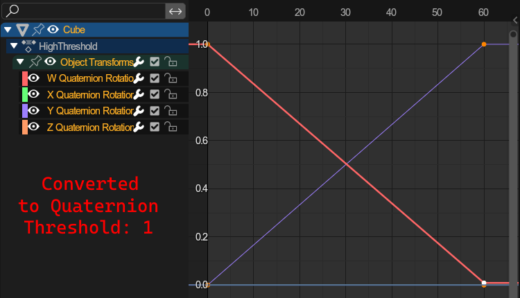

# Export Tools
{ align=right }

Several tools for exporting data to files.

 

---

## 3D model exporters

Common parameters between the model exporters:

- `Select Mode`: Determines which objects to target.
	- `All`: All objects in the current scene will be exported.
	- `Visible`: Only the visible object will be exported.
	- `Selected`: Only the selected objects will be exported.
- `Optimize`: Optimize vertex data and get rid of any duplicate.
	 **WARNING:** This may alter vertex order! Do not use for things that morph, like chao models or chao trees.
- `Automatic Node attributes`: Automatically determines several node attributes on export. [More info here](../../object/node.md).
- `Ensure positive euler angles`: Ensures that all nodes are exported with positive euler angles; E.g. -90° becomes 270°.
- `Automatic Root`: If the exported objects dont share a common root, a root parent will be created between them.
- `Force Sort Bones`: Blender orders bones by the order in which they were parented. Sometimes its needed to ensure bones get exported in alphabetical order, which this parameter ensures.
- `Developer Output: Debug Output`: Exports a .json file containing the processable mesh data that would be passed to the external library. **Only for debugging purposes, do not touch unless a developer**

- `Write Specular`: (**SA2 Only**) Include specular colors in material info.
- `Flip Vertex colors`: (**SA2 Only**) Flips the channel order of vertex colors (BGRA <-> ARGB). Used on chao garden models like trees.

### Export \*MDL
Exports the targeted objects as a model (*.*mdl) file.

Note that, when selecting only specific objects from the same hierarchy, only those objects will be exported, even if objects between them are missing. This allows for exporting models and deliberately leaving out specific models (but also any other object).

- `Apply armature posing`: If exporting an armature that is posed, the armature will be exported the way it is posed. Otherwise with default transforms.
- `NJ File`: Exports the file in .nj format.

---

### Export \*LVL
Exports the targeted objected as a landtable (*.*lvl) file.

- `Fallback surface attributes`: If an object has no surface attributes, it will receive the `Visible` and `Solid` attributes.

Parameters found under the "Animation" tab apply to animated geometry. See [Animation](#export-animations), and more specifivally [node animation](#export-node-animation) for info on the advanced options.

---

### Export SA2 Event
Export the current SA2 event.

Files exported (% = export filename):
- `%.prs`: Main file
- `%texture.prs`: Stores the texture archive
- `%texlist.prs`: Stores the texture name list
- `%motion.bin`: Stores animations

See [common model parameters](#3d-model-exporters) and [common animation parameters](#export-animations).

---

## Export Path
Exports the selected path to an INI file, or as a C struct directly insertable into your mods code.

- `Format`: File format to export to
	- `INI Format`: Export as INI file usable in other tools (and for reimporting)
	- `C Struct`: Export as a C file storing the path as a c struct for use in code (not reimportable).
- `Use path structs`: When importing using `C Struct`, it exports using the `Loop` and `LoopHead` structures.
	 With this checked, it exports using the `pathtbl` and `pathtag` structures.
- `Curve Code`: The code to run the path with
	- `Custom Code`: Enter your own code address using the `Custom Code Address` field
	- `SA1 Loops`: Used on most paths where the player is moved, i.e. Loops. _(Address: 0x4BB1F0)_
	- `SA2 Loops`: Used on most paths where the player is moved, i.e. Loops. _(Address: 0x497B50)_
	- `SA2 Grind Rails`: Used for most grind rails. _(Address: 0x4980C0)_
	- `SA2 Hand Rails`: Used for the hand/gravity rails used in Crazy Gadget. _(Address: 0x498140)_

---

## Export animations

These export animations to *.saanim files.

Common parameters between the exporters:

- `Use 16bit rotations`: Rotation channels only occupy 16 instead of 32 bits. Used primarily for chao animations.
- `Rotation Mode`: **(Advanced)** How rotations should be exported
	- `Euler`: Exports as euler rotations
	- `Quaternion`: Exports as quaternion rotations (not used by the sonic adventure games, but other titles using the ninja formats, like phantasy star online)
	- `Keep`: Export based on the rotation modes on objects
- `Ensure positive euler angles`: Ensures that all euler rotations are exported with positive angles; E.g. -90° becomes 270°.
- 

`Interpolation conversion deviation threshold`: (**Advanced**) | Click to expand

	- **Problem**: Blender allows for non-linear keyframes
	- **Solution**: Baking the interpolated keyframes
	- **The issues with that**: You may not want every frame in your animation to be baked (file size reasons).
	- **How this parameter affects the conversion**: The minimum amount a keyframe must divert from its interpolated counterpart to remain. 0 keeps all keyframes.
	- **The standard value:** Usually, a value around 0.05 is enough and gets rid of most unnecessary keyframes.
	- **Example:**

		|||
		|-|-|
		||| 

- 

`Quaternion conversion deviation threshold`: (**Advanced**) | Click to expand

	- **Problem**: Importing Euler rotation keyframes to Quaternion objects/bones or vice versa.
	- **Solution**: Converting keyframes between quaternion and euler.
	- **The issues with that**: Quaternion conversions are inaccurate, as the interpolation between those types is not linear. This means we must Bake the interpolated values as keyframes before converting.
	- **How this parameter affects the conversion**: The minimum amount a keyframe must divert from its interpolated counterpart to remain. 0 keeps all keyframes.
	- **The standard value:** Usually, a value around 0.05 is enough and gets rid of most unnecessary keyframes.
	- **Example:**

		|||
		|---|---|
		||| 

- `Optimiziation deviation threshold`: (**Advanced**) Similar to the Interpolation threshold, but applies to all frames in the animation (including manually placed ones).
- `Quaternion Optimiziation deviation threshold`: (**Advanced**) The same as the regular optimization, but specifically for quaternion rotations, as those use other value ranges.

### Export Node Animation
Exports the currently active node animation (either the one currently being edited, or the active action) of the target to an *.saanim file.
  Only works for objects with no children and armatures

- `Bone Localspace`: Export the animations relative to the armature. Unchecked, the animation will be exported relative to the world center.
- `Force Sort Bones`: Blender orders bones by the order in which they were parented. Sometimes its needed to ensure bones get exported in alphabetical order, which this parameter ensures.

You can read further on shape animations [here](../../../guides/animating.md#node-animations)

### Batch Export Node Animations
Performs `Export Node Animation` on all animation strips found on the targets NLA tracks. Files will receive the name of the action stored in the strip.

### Export Shape Animation
Exports the currently active shapekey animation (either the one currently being edited, or the active action) of the target to an *.saanim file.

- `Normal Mode`: How normals should be exported
	- `None`: No normal keyframes at all
	- `Typed`: Will be formatted to read as "has normals" but contains no actual normals data
	- `Nulled`: Add keyframes with a single Zero vector
	- `Full`: Add normal keyframes

You can read further on shape animations [here](../../../guides/animating.md#shape-animations)

### Export Camera animation
Exports the currently active animation set (either the one currently being edited, or the active action) of the target camera setup to an *.saanim file.

You can read further on camera animations [here](../../../guides/animating.md#camera-animations)
