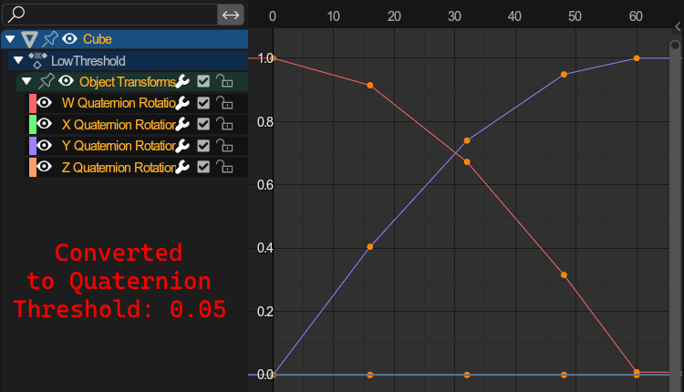

# Import Tools
{ align=right }

This panel holds all import operators.

 

---

## Import Model
Imports *.*mdl files.

- `Scene per File`: When importing multiple model files, every model will be put into its own scene.
- `Optimize`: If enabled, the addon will attempt and remove any duplicate vertices.
- `Auto normals for color-ony meshes`: If enabled, will ignore the single-directional normals provided by the addon for models that do not have actual normal data, and instead use flat shading.
- `Import as Armature`: Will import the model regardless of whether it is weighted or not.
- `All weighted meshes`: Meshes that would usually be parented to a bone will instead receive weights for that specific bone and receive an armature modifier.
- `Merge Meshes`: Merges all meshes to one for imported armatures.
- `Ensure sibling order`: Will add a three-digit prefix to all object names ("001_", "002_", etc.).
- `Flip Vertex colors`: (**SA2 Only**) Flips the channel order of vertex colors (BGRA <-> ARGB). Used on chao garden models like trees.

---

## Import Landtable.
Imports *.*lvl files and changes the scene to a landtable scene.

- `Scene per File`: When importing multiple level files, every level will be put into its own scene.
- `Optimize`: If enabled, the addon will attempt and remove any duplicate vertices.
- `Auto normals for color-ony meshes`: If enabled, will ignore the single-directional normals provided by the addon for models that do not have actual normal data, and instead use flat shading.
- `Adjust clip distance`: Changes the 3D view clip distance to make viewing the geometry easier.
- `Ensure landentry order`: Will add a four-digit prefix to all land entry names ("0001_", "0002_", etc.).

Parameters found under the "Animation" tab apply to animated geometry. See [Animation](#import-node-animation) for info on the advanced options.

---

## Import SA2 Event
Import main sa2 event files.

- `Optimize`: If enabled, the addon will attempt and remove any duplicate vertices.
- `Auto normals for color-ony meshes`: If enabled, will ignore the single-directional normals provided by the addon for models that do not have actual normal data, and instead use flat shading.

---

## Import Path (.ini)
Imports a Path as a curve.

---

## Import Node Animation
Imports a node animation.

Node animations hold Position, Rotation and Transform animations.
 Can only be used on objects that have no children or armatures. If no target is selected, it will be greyed out.

- `Rotation Mode`: How rotations should be imported
	- `KEEP`: Will use target rotation modes. This means that, if an animation uses euler animations, but the target uses e.g. Quaternion, **the rotations will be converted** to Quaternion.
	- `ANIMATION`: Will use rotation modes to suit the imported animation. This means that, if an animation uses euler animations, but the target uses e.g. Quaternion, the **targets rotation mode will be changed** to use euler.
- 

`Quaternion conversion deviation threshold`: (**Advanced**) | Click to expand

	- **Problem**: Importing Euler rotation keyframes to Quaternion objects/bones or vice versa.
	- **Solution**: Converting keyframes between quaternion and euler.
	- **The issues with that**: Quaternion conversions are inaccurate, as the interpolation between those types is not linear. This means we must Bake the interpolated values as keyframes before converting.
	- **How this parameter affects the conversion**: The minimum amount a keyframe must divert from its interpolated counterpart to remain. 0 keeps all keyframes.
	- **The standard value:** Usually, a value around 0.05 is enough and gets rid of most unnecessary keyframes.
	- **Example:**

		|  |   |
		|---|---|
		|  |   |

	

---

## Import Shape Animation
Imports shape animations.

Shape animations hold shapekey animations, and can be distributed among multiple objects (and as such require multiple actions).
 Can only be used on objects that have no children or armatures. If no target is selected, it will be greyed out.

- `Force Sort Bones`: Blender orders bones by the order in which they were parented. Sometimes its needed to ensure bones get exported in alphabetical order, which this parameter ensures.
- `Optimize`: If enabled, the addon will compare the shapekeys used in the motion against already existing shapekeys on the target objects and reuse those that closely resemble the ones from the imported animation. Otherwise, it'll always create new shape keys for every motion file imported.

---

## Import Camera Animation
Imports a camera animation to a camera setup.

