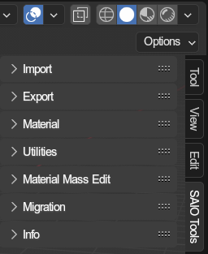

# Toolbar Tools
{ align=right }

The addon provides a lot of tools, all of which can be accessed through the panels in this 3D View toolbar.

the toolbar encompasses following panels:

- [**Import**](./import.md): Importing data from files.
- [**Export**](./export.md): Exporting data to files.
- [**Material**](./material.md): Various material utilities.
- [**Utilities**](./utilities.md): All sorts of utilities.
- [**Material Mass Edit**](./material_mass_edit.md): For quickly editing material data.
- [**Migration**](./migration.md): Tools to migrate blender projects from the old addon.
- **Info**: Open various internet resources.
