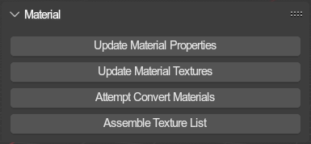

# Material Tools
{ align=right }

Utilities to help you manage and update materials.

Most of these share the `target mode` parameter:

- `Active Material`: Targets the active material (the one you are currently editing).
- `Selected Objects`: Targets materials of all selected objects.
- `Scene Objects`: Targets materials of all objects in the active scene.
- `All`: Targets all materials in the file.

 

---

## Update Material Properties

Will go through every targeted material and update their node tree based on their SAIO properties.
  **Excluding textures,** this only affects how the materials look in material view.

Materials that have not yet been set up this way, will be set up, **including finding its texture and inserting it**.
 If a material has already been set up, this will only change colors and other parameters, but not the texture.

Importers automatically execute this process to set up materials on import.

---

## Update Material Textures

Updates the texture slot or texture id of target materials.

- `Mode`:
	- `Texture Image`: Looks up the texture using the materials texture id and applies it to the material.
	- `Texture ID`: Looks up the texture id using the materials applied texture and applies it to the material.

---

## Attempt Convert Materials

Attempts to convert materials (that have not yet been set up) to SAIO materials.
  It will do so by looking at the texture nodes of every targeted material, and setting up a material with that texture.

- `Assemble texture list`: Whether to assemble a texture list with the textures found on all materials. The list will be applied to the current scene.
- `Global index offset`: The global index at which the textures should start.

---

## Assemble Texture List

Assembles a texture list from applied textures on all materials in the scene or event.

- `Mode`:
	- `Scene`: Assembles the list for the current scene and applies it to the scene.
	- `Event`: Assembles the list for all scenes involving the current event (that the scene belongs to) and applies it to all involved scenes.
- `Global index offset`: The global index at which the textures should start