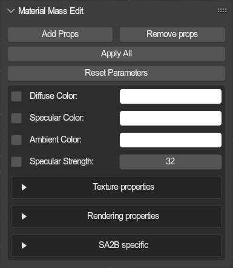

# Material Mass Edit
{ align=right }

This menu allows for editing many material at once.

Non-checkbox parameters can be checked for copying over to target materials. You will find these to the left of the actual property. These do not exist for checkboxes belonging to the material parameters.

 

!!! Info
	Previously, this was the "Quick Edit" menu, used for editing every addon property on objects en masse. Since then, blender has added the ability to set a property on many selected objects/bones at once by simply holding the `alt` key while doing so, thus eliminating the need for the old quick edit menu. However, there is no way to "select" multiple materials at once, which is what these tools were then kept for.

---

## Add Props
When pressed, every checkbox parameter that is marked will be checked on the target materials.
  Additionally, every non-checkbox parameter that is marked to be applied (checkbox to the left) will be copied to the target materials.

## Remove Props
When pressed. Every material checkbox that is marked will be unchecked on the target materials.
  This has no effect on none-checkbox materials

## Apply All
Regardless of whether non-checkbox materials are marked, all properties will be written as they are to the target materials (essentially copying themselves).

## Reset Parameters
Resets all parameters below. (Unckecks all checkboxes and resets non-checkbox parameters to their default value).