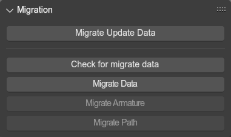

## Migration
{ align=right }

Tools specifically for migrating projects from the old addon to the new one.

 

---

## Check for migrate data
Checks whether there is any data from the old addon in the file, and if so, enables the other migration tools.

## Migrate Data
Migrates all the custom added properties, like material properties or scene settings.

## Migrate Armature
In the old addon, the root node on models was interpreted as the armature object itself, while SAIO instead adds it as a bone in the armature to allow for animating it. This operator adds the bone to the armature.

## Migrate Path
Converts an old path setup to a curve that can be exported as a path.